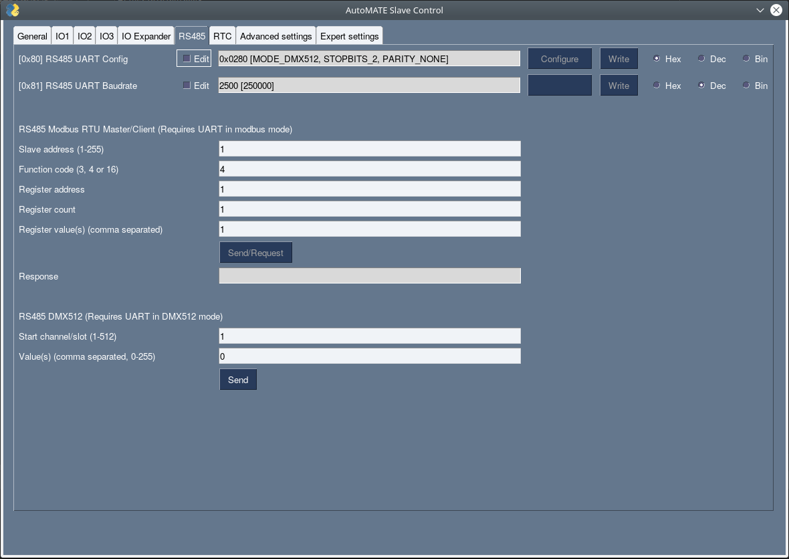

# AutoMATE Control
AutoMATE Control is a tool to control the slave microcontroller of AutoMATE boards. This can be with either USB or I2C.
For I2C the setup is more complicated as you have to use jumper wires to hook up on the internal I2C bus.  
  
AutoMATE Control is not required if you use the ESP32 to communicate (through I2C) with the slave microcontroller (STM32).  
However, it can be useful for debugging and monitoring registers.


## Website
WIP

## Installation
### Linux
Get the source code and check it out in the current directory:  
```
git clone https://github.com/automateboards/automate-control.git
```

Install for the current user by running the install script:  
```
sudo sh ./automate-control/linux_install.sh
```

To start Automate Control:  
```
automatectrl
```
### Windows
TODO

## Screenshots

### General
 

### IO
 

### IO Expander
 

### RS485
 
 
### RTC
 

